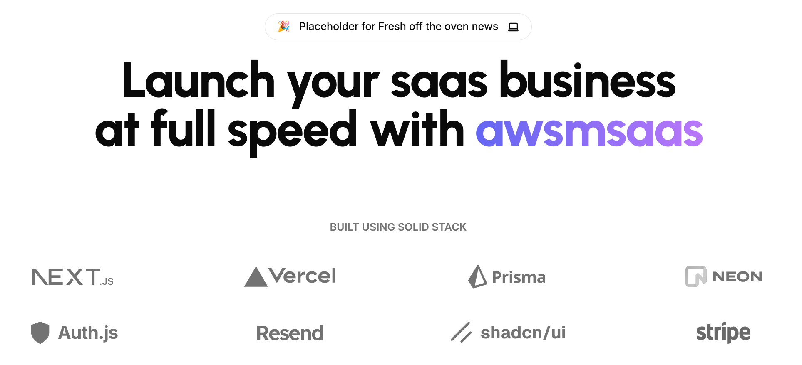

<a href="https://next-saas-stripe-starter.vercel.app">
  
  <h1 align="center">NextJS SaaS Stripe Starter</h1>
</a>

<p align="center">
  NEXTJS SaaS Starter !
</p>

<p align="center">
  <a href="#introduction"><strong>Introduction</strong></a> ·
  <a href="#installation"><strong>Installation</strong></a> ·
  <a href="#tech-stack--features"><strong>Tech Stack + Features</strong></a> ·
</p>
<br/>

## Introduction

Empower your next project with the stack of Next.js 14, Prisma, Neon, Auth.js v5, Resend, React Email, Shadcn/ui, and Stripe.
<br/>
All seamlessly integrated with the SaaS Starter to accelerate your development and saas journey.

## Installation

Download & unzip the code in your local.
Push the code to Github repository.  
You can deploy to vercel using github

### Steps

Editor Preference: We prefer VSCODE editor, but you are free to use whatever you like. 

1. Install dependencies using pnpm:


```sh
pnpm install
```

If pnpm isnt installed, use
```sh
npm install -g pnpm
```

2. Copy `.env.example` to `.env` and update the variables.

```sh
cp .env.example .env
```

Open .env in your code editor, to update values as follows.

2.1  Generating Auth.js secret

Guide: [https://authjs.dev/getting-started/installation?framework=Next.js](https://authjs.dev/getting-started/installation?framework=Next.js)

Run the following command, it will automatically generate Auth secret in .env.local

```sh
npx auth secret
```

Oauth Guide: [https://authjs.dev/getting-started/authentication/oauth](https://authjs.dev/getting-started/authentication/oauth)


2.2 Configure Google Oauth ID & Secret

a. Register OAuth App in Google's dashboard to get client id & secret
Guide: [https://support.google.com/cloud/answer/6158849?hl=en](https://support.google.com/cloud/answer/6158849?hl=en)

```sh
callback url: [origin]/api/auth/callback/google
```

2.3 Configure Postgres Prisma database at Neon.tech

Register at https://neon.tech/ & create a free postgres prisma database. 
Make sure to check their pricing as per your requirement. Their free tier is very generous. 
You can also use other providers as an alternative based on your preference.

Push prisma migrations: 

```sh
npx prisma db push
```


2.4 Configure Stripe API keys: 

Use this guide to setup Stripe keys: 
Guide: [https://next-saas-stripe-starter.vercel.app/docs/configuration/subscriptions](https://next-saas-stripe-starter.vercel.app/docs/configuration/subscriptions)


a. Signup at Stripe for payment plans. GO to Developer settings > API
to generate an API key 
b. Comfigure webhook events 
c. Configure products & pricing plans, past price-plan ids in .env file 

3. Start the development server:

```sh
pnpm run dev 
```

## Roadmap 
- [ ] Add resend for success subscriptions 

### Frameworks 

- [Next.js](https://nextjs.org/) – React framework for building performant apps with the best developer experience
- [Auth.js](https://authjs.dev/) – Handle user authentication with ease with providers like Google, Twitter, GitHub, etc.
- [Prisma](https://www.prisma.io/) – Typescript-first ORM for Node.js
- [React Email](https://react.email/) – Versatile email framework for efficient and flexible email development

### Platforms

- [Vercel](https://vercel.com/) – Easily preview & deploy changes with git
- [Resend](https://resend.com/) – A powerful email framework for streamlined email development
- [Neon](https://neon.tech/) – Serverless Postgres with autoscaling, branching, bottomless storage and generous free tier.

### UI

- [Tailwind CSS](https://tailwindcss.com/) – Utility-first CSS framework for rapid UI development
- [Shadcn/ui](https://ui.shadcn.com/) – Re-usable components built using Radix UI and Tailwind CSS
- [Framer Motion](https://framer.com/motion) – Motion library for React to animate components with ease
- [Lucide](https://lucide.dev/) – Beautifully simple, pixel-perfect icons
- [`next/font`](https://nextjs.org/docs/basic-features/font-optimization) – Optimize custom fonts and remove external network requests for improved performance
- [`ImageResponse`](https://nextjs.org/docs/app/api-reference/functions/image-response) – Generate dynamic Open Graph images at the edge

### Hooks and Utilities

- `useIntersectionObserver` – React hook to observe when an element enters or leaves the viewport
- `useLocalStorage` – Persist data in the browser's local storage
- `useScroll` – React hook to observe scroll position ([example](https://github.com/mickasmt/precedent/blob/main/components/layout/navbar.tsx#L12))
- `nFormatter` – Format numbers with suffixes like `1.2k` or `1.2M`
- `capitalize` – Capitalize the first letter of a string
- `truncate` – Truncate a string to a specified length
- [`use-debounce`](https://www.npmjs.com/package/use-debounce) – Debounce a function call / state update

### Code Quality

- [TypeScript](https://www.typescriptlang.org/) – Static type checker for end-to-end typesafety
- [Prettier](https://prettier.io/) – Opinionated code formatter for consistent code style
- [ESLint](https://eslint.org/) – Pluggable linter for Next.js and TypeScript

### Miscellaneous

- [Vercel Analytics](https://vercel.com/analytics) – Track unique visitors, pageviews, and more in a privacy-friendly way